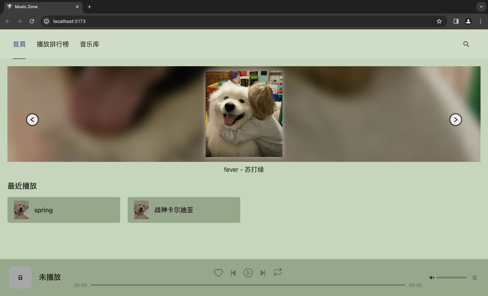
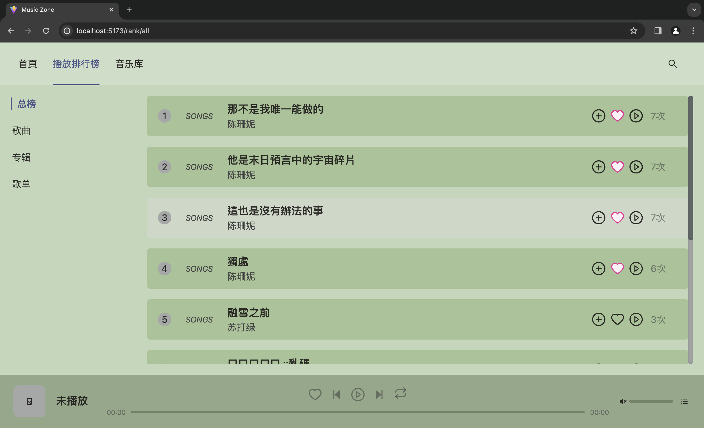
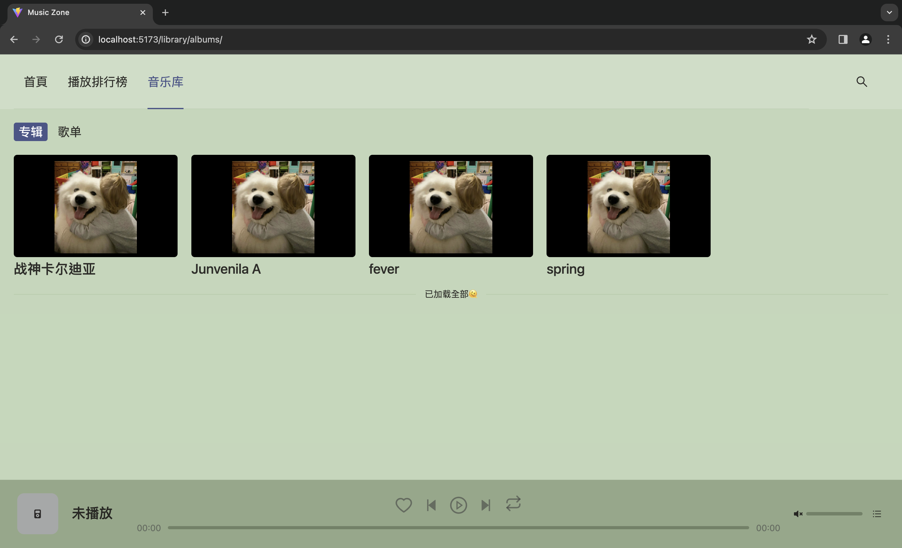
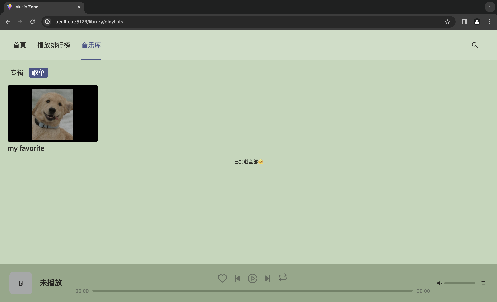
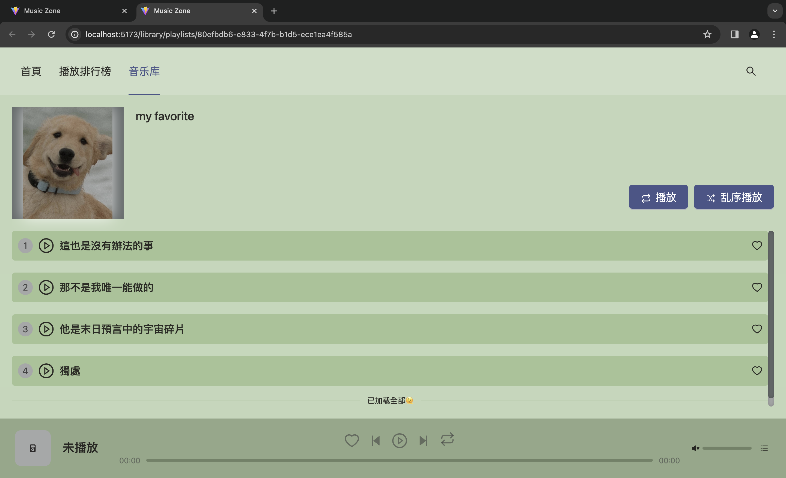
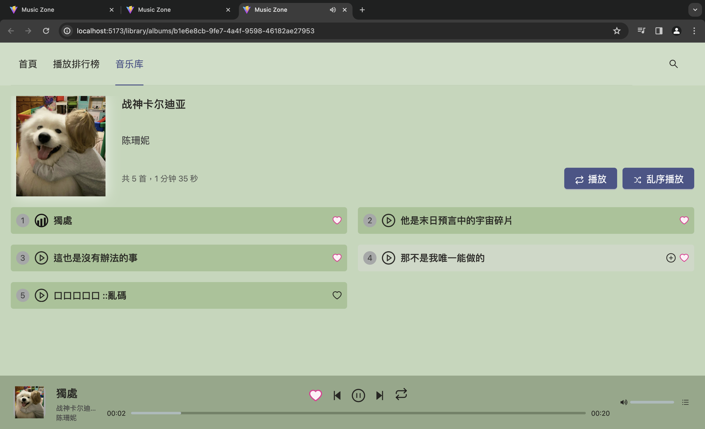
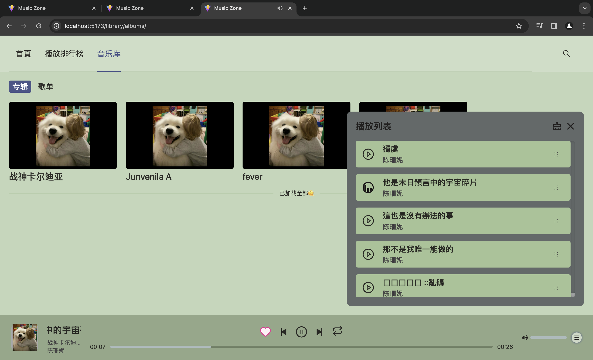
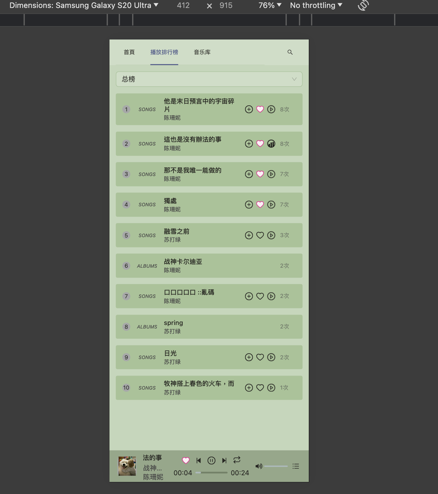
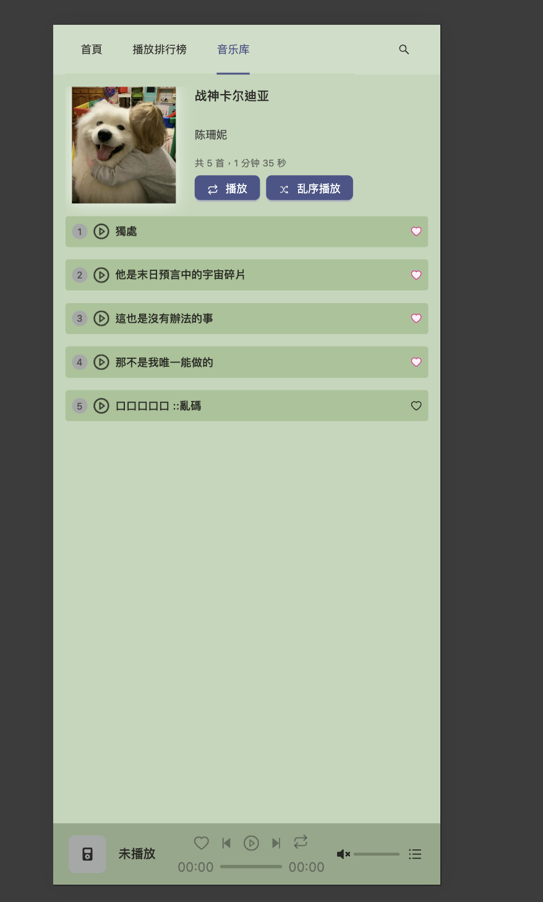

# music-zone-front-end

using `react` + `typescript` + `redux/toolkit` + `react-router` + `antd`

# run

```bash
yarn
yarn dev
```

# 应用展示











# 功能描述

## 首页

1. banner: 部分专辑轮播。
2. 最近播放。

## 播放排行榜

1. 总榜
2. 专辑
3. 歌曲
4. 歌单

列表数据滚动加载

## 音乐库

1. 专辑
2. 歌单

列表数据滚动加载

## 全局检索

搜索名字/描述相关的专辑、歌曲、歌单。
